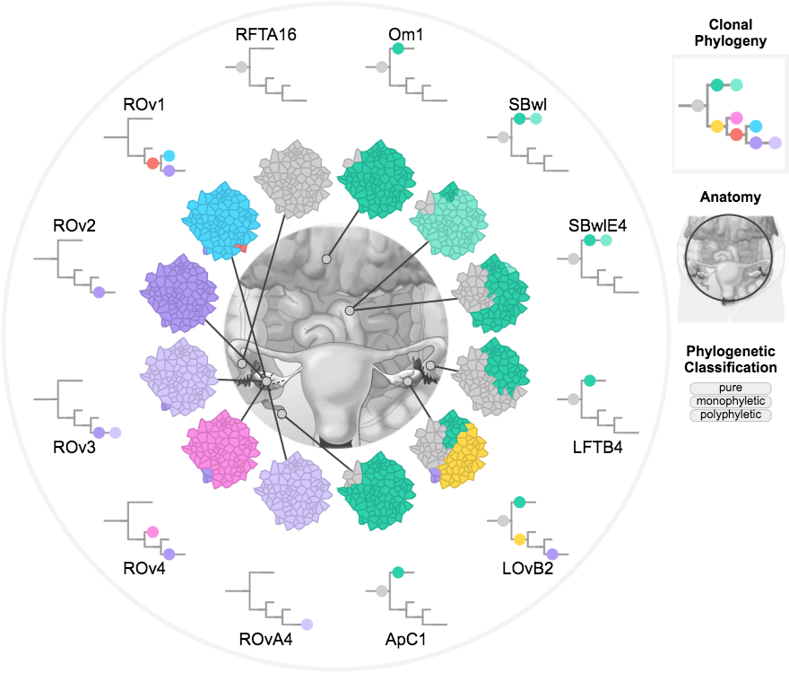

MapScape is a visualization tool for spatial clonal evolution.

To run MapScape:

install.packages("devtools") # if not already installed  
library(devtools)  
install_bitbucket("MO_BCCRC/mapscape")  
library(mapscape)  
example(mapscape)  

Two visualizations will appear in your browser.

The first is of metastatic prostate cancer data published in Gundem et al. (2015):

The second is of metastatic ovarian cancer data published in McPherson and Roth et al. (2015):

MapScape was developed at the Shah Lab for Computational Cancer Biology at the BC Cancer Research Centre.
 
References:  
Gundem, Gunes, et al. "The evolutionary history of lethal metastatic prostate cancer." Nature 520.7547 (2015): 353-357.
McPherson, Andrew, et al. "Divergent modes of clonal spread and intraperitoneal mixing in high-grade serous ovarian cancer." Nature genetics (2016).