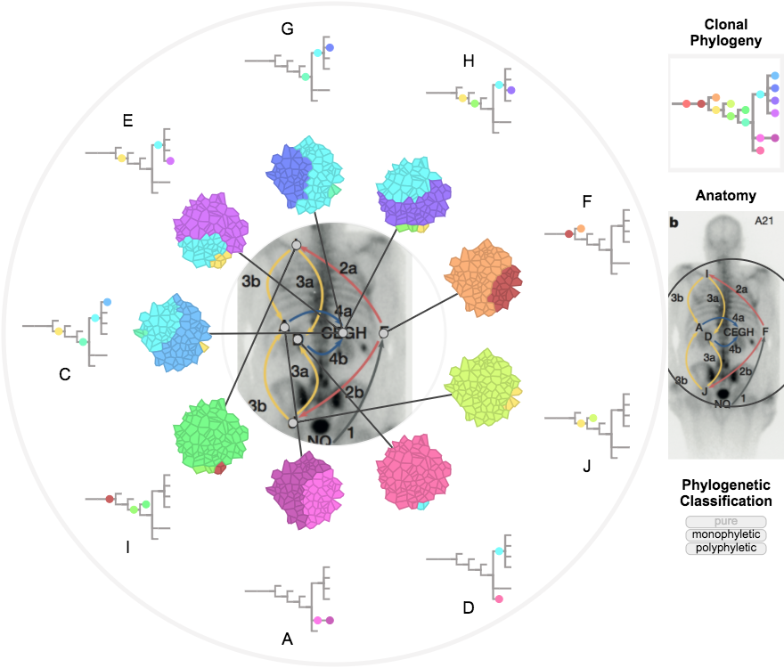

MapScape is a visualization tool for spatial clonal evolution.

To run MapScape, type the following commands in R:

install.packages("devtools") # if not already installed  
library(devtools)  
install_bitbucket("MO_BCCRC/mapscape")  
library(mapscape)  
example(mapscape) # to run examples

Three visualizations will appear in your browser (optimized for Chrome).

The first is of metastatic prostate cancer data published in Gundem et al. (2015):

The second and third visualizations are of metastatic ovarian cancer patients 1 and 7 published in McPherson and Roth et al. (2015):

MapScape was developed at the Shah Lab for Computational Cancer Biology at the BC Cancer Research Centre.
 
References:  

Gundem, Gunes, et al. "The evolutionary history of lethal metastatic prostate cancer." Nature 520.7547 (2015): 353-357.

McPherson, Andrew, et al. "Divergent modes of clonal spread and intraperitoneal mixing in high-grade serous ovarian cancer." Nature genetics (2016).
